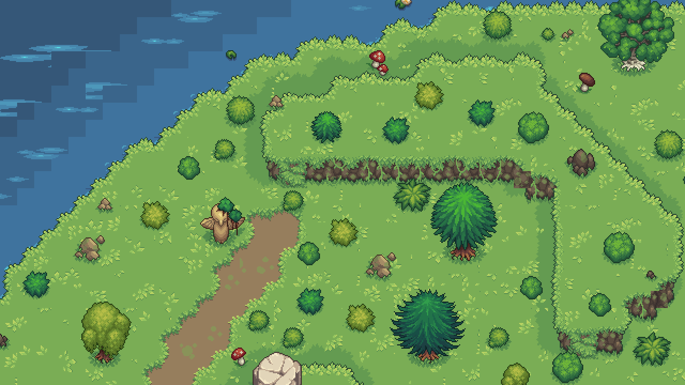
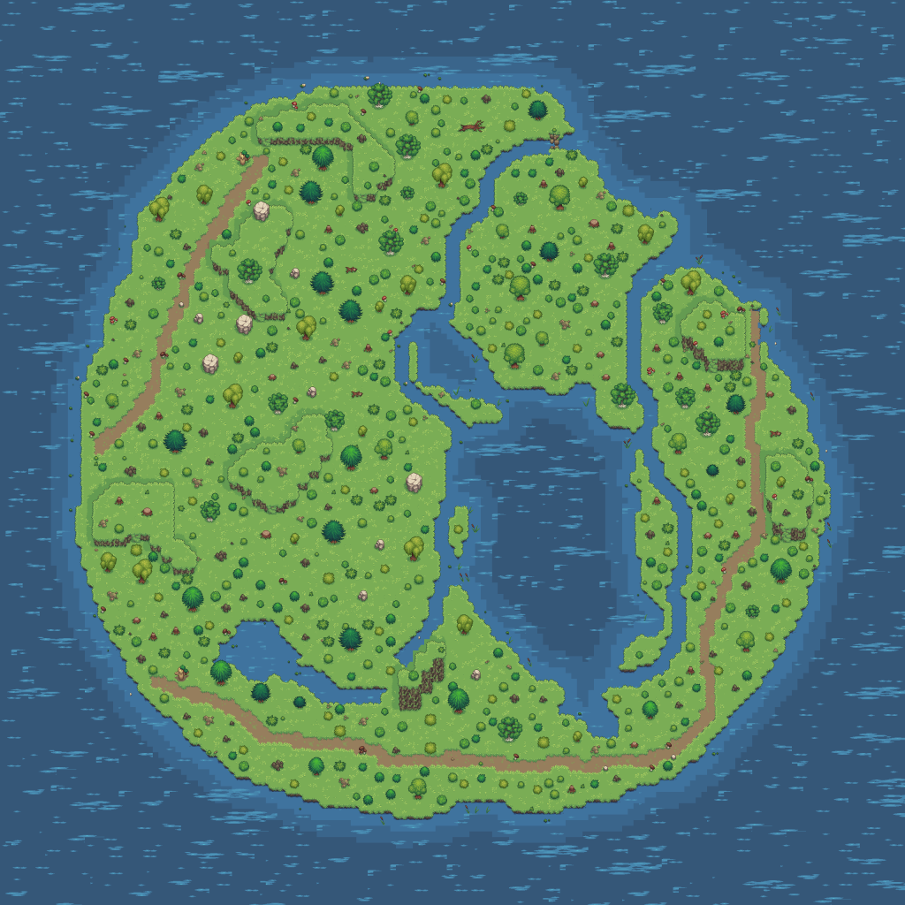
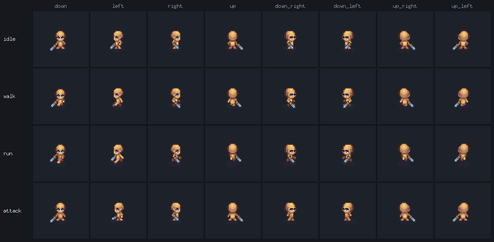
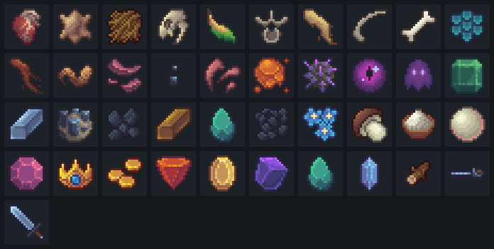
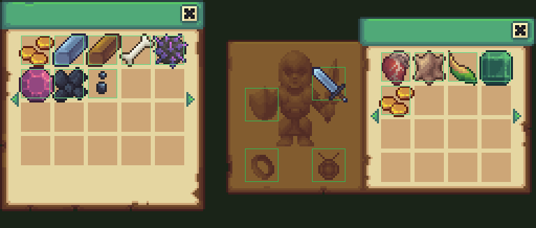
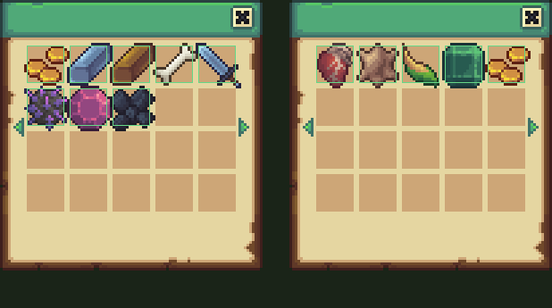
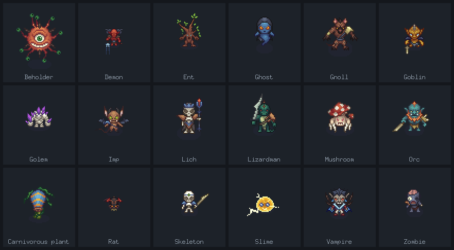
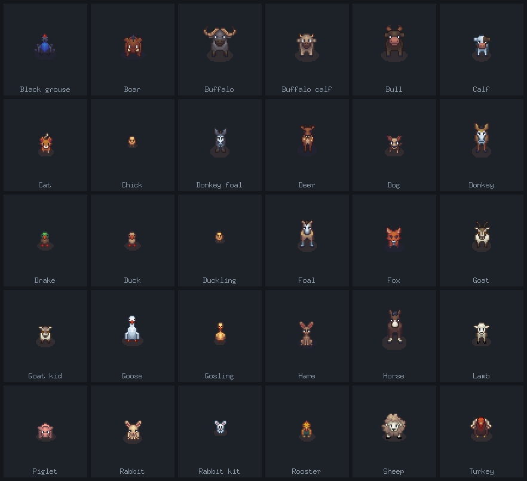

# Pixel ARPG

[](https://github.com/verbitsky-vladislav/arpg-go/actions/workflows/ci.yml)
[](https://go.dev)
[](https://ebitengine.org)

**Пиксельная ARPG с видом сверху.** Остров, лес, тропы, звери и те, кто в лесу
живёт не по-доброму. Меч в руке, курсор — прицел, и чем дальше от берега, тем
злее встречают.

### ⬇ Скачать и играть

[**Windows**](https://github.com/verbitsky-vladislav/arpg-go/releases/download/nightly/pixel-arpg-windows-amd64.zip) ·
[**macOS**](https://github.com/verbitsky-vladislav/arpg-go/releases/download/nightly/pixel-arpg-macos.zip) ·
[**Linux**](https://github.com/verbitsky-vladislav/arpg-go/releases/download/nightly/pixel-arpg-linux-amd64.zip)

Около 10 МБ: распакуйте папку целиком и запустите `pixel-arpg` — ничего
ставить не нужно. Это свежая сборка `main`: она пересобирается на каждое
изменение, поэтому бывает и лучше вчерашней, и хуже. Отмеченные версии —
[в релизах](https://github.com/verbitsky-vladislav/arpg-go/releases).



Или из исходников:

```bash
go run ./cmd/game
```

---

## Ваш остров

У каждого героя свой остров, и он появляется вместе с ним — один раз и
навсегда. Бухты, озёра, натоптанные тропы, плато с обрывами, на которые надо
искать лестницу. Карта помнит всё: где вы уронили добычу, кого не добили, какой
сундук так и не открыли.



Заблудиться — можно. Свернуть не туда и выйти к тем, кто вам не по зубам, —
тоже.

## Герой

Восемь направлений, походка, бег, замах. Идёте вы куда хотите, а смотрите и
бьёте туда, где курсор: можно рубить, отступая.



Мужчина или женщина, кулаки, палка или меч — оружие меняет и то, как вы
выглядите в бою, и то, насколько больно от вас.

## Бой, добыча, снаряжение

41 предмет: шкуры и клыки с убитых, самоцветы из сундуков, оружие, кольца,
амулеты.



Кулаками — 1–2. Палкой — 2–4. Зайца забить можно, энта — нет: за оружием
придётся сходить. Что подобрали, то и надели; что не влезло — лежит в сумке.

| снаряжение | сундук |
|---|---|
|  |  |

## Украсть чужую силу

Главное, ради чего стоит лезть в драку. С убитого врага падает камень с **его
собственной атакой** — дыхание демона, залп бехолдера, гниль зомби. Камень
ложится в одну из трёх ячеек (`Q` `E` `R`), и дальше вы бьёте не своим.

Зарядов считанные штуки, и чем страшнее была тварь, тем меньше их дадут. Сила
кончилась — идите за новой.

## Кто вас там ждёт

Восемнадцать пород по три силы — шестьдесят разных тварей, плюс усиленные
особи (★), которые крупнее, злее и щедрее.



Они не стоят столбами. Со спины враг вас не видит — можно подкрасться. Слышит
по-настоящему: за поворотом услышит, сквозь скалу — нет. Гуманоиды дерутся
строем и зовут подмогу, засадники срываются с места поздно, но сразу.

## И те, кто просто живёт

Тридцать видов зверья: лисы, кабаны, олени, гуси, домашняя живность, детёныши,
которые вырастают во взрослых. Кто-то удирает, кто-то бросается.



## Забег

Три героя, три жизни, три острова. Всё сохраняется само: где вы стояли, кого
успели убить, что лежит на земле, сколько зарядов осталось в украденной силе.
Вышли — вернулись ровно туда же.

Опыт, уровни, бестиарий с теми, кого уже встречали, и журнал: кого и сколько.

Звук свой — шаги, замахи, попадания и музыка леса.

---

## Управление

| действие | клавиша |
|---|---|
| ходьба | `W` `A` `S` `D` |
| бег | `ПРОБЕЛ` |
| удар | `ЛКМ` (дубль — `C`) |
| украденные умения | `Q` `E` `R` |
| сумка | `I` |
| открыть сундук | `V` |
| карта | `TAB` |
| пауза | `ESC` |

Всё переназначается в настройках.

---

## Устройство

Нужен Go 1.24+. Ассеты читаются с диска, поэтому правка картинки видна без
пересборки.

```
cmd/game            точка входа: окно, загрузчик ресурсов, меню
internal/
  worldgen          генератор карт: высоты, вода, тропы, плато, автотайлинг, валидация
  world             карта в игре: тайлы, слои, физика, камера
  scene             экраны: меню, забег, персонажи, бестиарий, сундук, снаряжение
  character         герой: таблица, автомат состояний, анимация
  mob               звери, враги, ИИ, отряды, спавн, добыча, кража силы
  combat            числа удара: база героя плюс вещь в руке
  item              каталог, сумка, снаряжение
  progress          уровни, опыт, очки
  save              три персонажа, мир на диске
  audio             банк звуков и правила проигрывания
  sprite anim gfx   спрайт-паки, клипы, отрисовка
  ui settings       полосы, окна, курсор, настройки и клавиши
assets/             паки, нормализованные и размеченные манифестами
docs/               каноничные описания форматов и правил
tools/              генераторы и просмотрщики (ниже)
```

38 000 строк Go, 237 тестов. Тесты стерегут не только код, но и **данные**:
что каждая пара «тело × оружие» рисуется во всех состояниях, что полосы опыта
не разъехались с балансом, что ни один моб не уходит без добычи.

```bash
go test ./...
```

## Инструменты

| | |
|---|---|
| [`tools/worldgen`](tools/worldgen) | генератор карт: картинки, отчёт валидации, дампы тайлов |
| [`tools/assetnorm`](tools/assetnorm) | режет сырые паки в наш вид и пишет манифест |
| [`tools/spriteanchor`](tools/spriteanchor) | дописывает в манифест рамку и точку опоры по пикселям |
| [`tools/dir8`](tools/dir8) | достраивает пак до восьми направлений |
| [`tools/weaponskin`](tools/weaponskin) | перекраска оружия по слоям (меч → палка) |
| [`tools/iconnorm`](tools/iconnorm) | нарезка иконочных паков по прозрачным промежуткам |
| [`tools/charview`](tools/charview) | просмотрщик персонажа: сетка клипов и живой режим |
| [`tools/sfxgen`](tools/sfxgen), [`tools/musgen`](tools/musgen) | синтез звуков и музыки |
| [`tools/showcase`](tools/showcase) | картинки для этого README (`go run ./tools/showcase`) |
| [`tools/pack`](tools/pack) | ресурсы для раздачи: едет только то, что в игре появится ([release.md](docs/release.md)) |

## Документация

| | |
|---|---|
| мир | [worldgen.spec](docs/worldgen/worldgen.spec.md) · [автотайлинг](docs/worldgen/autotiling.md) · [слои и плато](docs/worldgen/layers_and_plateau.md) · [формат карты](docs/worldgen/map_format.md) · [манифест биома](docs/worldgen/manifest.schema.md) · [подключение тайлсета](docs/worldgen/tileset-onboarding.md) |
| герой | [персонаж](docs/character/character.md) · [числа удара](docs/character/combat.md) · [прокачка](docs/character/progress.md) |
| мобы | [виды зверей](docs/mobs/species.md) · [их спавн](docs/mobs/spawn.md) · [враги и боссы](docs/mobs/enemies.md) · [ИИ](docs/mobs/enemies_ai.md) · [заселение картой](docs/mobs/enemies_spawn.md) · [добыча](docs/mobs/loot.md) |
| прочее | [сохранение](docs/save.md) · [звук](docs/sound.md) · [сборка под раздачу](docs/release.md) |

## Чего ещё нет

- **биомов** — из двенадцати задуманных сделан один (лес); остальным нужны
  манифест и разметка тайлсета;
- **боссов** — описан и нарисован один (слизь), боевой сцены под них нет;
- **дерева пассивок** — задумано плотным кругом в духе PoE, в игре его нет;
- **локаций** — подземелья, деревни и пещеры лежат ассетами, генератора под
  них ещё нет;
- **сюжета и смены дня и ночи** — данные под ночь есть, самой ночи нет.

## Права

Код — [MIT](LICENSE): берите, режьте, делайте своё.

Графика — пиксельные паки [CraftPix](https://craftpix.net), приведённые к общей
раскладке инструментами проекта. На них MIT **не распространяется**: паки
остаются под своей лицензией, и вынуть их отсюда в свой проект нельзя
([подробнее](assets/LICENSE.md)). Звук свой, синтезированный, и идёт вместе с
кодом.
