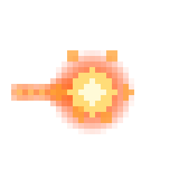
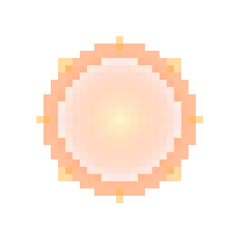
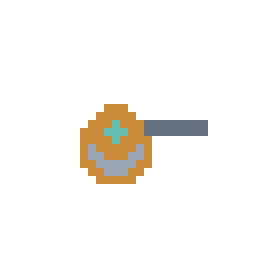
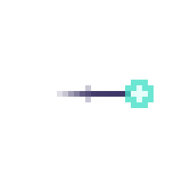
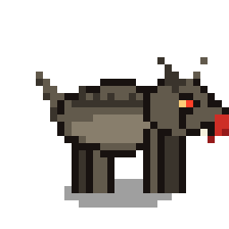
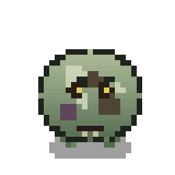
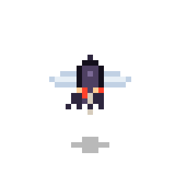

# Арт-дирекшн

Статус: 🟡 черновик — пайплайн зафиксирован, стиль уточняем
Связь с кодом: `internal/gfx`, `internal/art` (процедурно), `internal/assets`,
`internal/anim`, `internal/hero` (PNG-анимации героев)

## Как делаем графику

Всё делается **кодом** (не берём готовые пресеты). Два пути, комбинируем:

1. **Процедурно в рантайме** — простые формы и эффекты рисуем прямо в игре из
   пиксельных карт (пакет `gfx`, конкретные спрайты в `art`). Так сделаны игрок,
   мобы и снаряды.
2. **PNG-спрайты (генерируемые кодом)** — отдельный Go-инструмент
   `tools/spritegen` (stdlib `image/png`, вне игрового бинарника) собирает кадры
   и кладёт их в `assets/sprites/`. Игра встраивает каталог через `//go:embed`
   и грузит кадры загрузчиком (`assets.Loader`). Так сделаны **герои**.

## Спрайты героев и анимация

Каждый герой — нативный пиксель-арт **32×32**, апскейл ×8 до **256×256**
(чёткие «жирные» пиксели). В `assets/sprites/heroes/<id>/`:

- `base.png` — исходный статичный спрайт (источник правды);
- по каталогу на действие: `idle/ walk/ take_damage/ attack/ punch/ loot/`, в каждом —
  **16 кадров** `frame_00.png … frame_15.png`.

Кадры получены **процедурно из `base.png`** инструментом `tools/spritegen`: он
понижает спрайт до сетки 32×32 и строит каждый кадр обратным попиксельным
преобразованием (боб, наклон, присед, подъём ноги, красная вспышка урона), затем
апскейлит обратно. Поэтому анимации бесплатны в поддержке: меняешь `base.png` —
перегоняешь все кадры одной командой:

```
go run ./tools/spritegen assets/sprites/heroes
```

16 кадров выбраны вместо 8, потому что 8 давали заметные рывки.

В игре кадры проигрывает единый механизм `anim.Clip`/`anim.Player`
(см. `../tech/architecture.md`). Тайминги действий заданы в одном месте
(`hero.actionDefs`).

## Направленность героев — 4 направления (top-down)

**Сделано:** три реальных вида — **`down`** (фронт), **`up`** (спина) и **`side`**
(профиль лицом вправо). Взгляд **влево** — это `side`, **отражённый** по
горизонтали (`GeoM.Scale(-1,1)`). Итого 4 направления взгляда из 3 наборов кадров:
front / back / вправо / влево.

Почему не поворот спрайта: герои нарисованы фронтально (видно лицо, ноги внизу),
`GeoM.Rotate` их бы «уложил». Поворот годится лишь для строгого вида сверху.

**Как строятся виды (`tools/spritegen`):**
- **`down`** — исходный `base.png`.
- **`up`** (спина) — из `down` **заливкой полосы лица** цветом убора/волос сверху
  (глаза/черты исчезают, силуэт тот же); полоса настраивается на героя (`upParams`).
- **`side`** (профиль) — **параметрическая пиксель-отрисовка** (`buildSide`) в
  палитре героя: голова в профиль (один глаз + нос), убор/оружие по силуэту,
  авто-контур. Профиль нельзя получить деформацией фронта (другой силуэт), поэтому
  он рисуется, а не варпится; палитра берётся из `base.png` (`sideParams`).

Все три вида затем анимируются **одними и теми же** преобразованиями; ориентиры
(земля/бёдра) считаются под силуэт каждого вида.

**Как выбирается направление в бою:** из вектора движения (а при касте — прицела)
берём угол `atan2`: вверх → `up`; вниз → `down`; вбок → `side` с флипом по знаку X.
Эффекты и снаряды остаются **360°** (см. «Спрайты скиллов»): тело — 4 положения,
а огненный шар/удар летит точно в курсор — как в Diablo/PoE.

**Раскладка ассетов:** `assets/sprites/heroes/<id>/<facing>/<action>/frame_NN.png`,
`facing ∈ {down, up, side}`. Бюджет: 3 вида × 6 действий × 16 = **288 кадров на
героя**. Перегон: `go run ./tools/spritegen assets/sprites/heroes`.

**Код:** `hero.Clip(action, facing)` (`facing ∈ {Down, Up, Side}`); флип для
зеркальной стороны — в отрисовке (`ui.DrawSpriteFitFlip`). В галерее
(`scene/heroselect`) стрелки вверх/вниз переключают вид, влево/вправо — героя.

## Спрайты скиллов (эффекты)

Каждый скилл (`../mechanics/skills.md`) имеет **2 анимации** по **16 кадров**,
нативно 32×32 ×8 = 256×256, в `assets/sprites/skills/<skill>/<anim>/frame_NN.png`:

- **`cast`** — основной эффект в действии (дуга / полёт / вихрь / рывок / разворот);
- **`impact`** — попадание/финал (искры / взрыв / пробой / выстрел).

Скиллы: `raskol · vortex · pierce · dash · fireball · turret`.

**Направленность (top-down).** Направленные эффекты нарисованы вдоль **+X**
(вправо); в игре поворачиваются на угол прицела через `GeoM.Rotate` — полный
360°, как снаряды. Радиальные (взрыв, вихрь, пульс) симметричны, поворота не требуют.

**Цвет по типу урона** (`../mechanics/damage-and-defense.md`): физ. — сталь/белый,
огонь — оранжево-жёлтый, дэш Ассасина — индиго + бирюза, турель — латунь.

> ⚠️ На **белом** фоне превью светлые эффекты (Раскол, Стрела) почти не видны —
> это артефакт фона. В игре фон тёмный, там они читаются.

| Эффект (кадр) | Картинка |
|---------------|----------|
| Огненный шар — cast |  |
| Огненный шар — impact |  |
| Турель — cast |  |
| Теневой рывок — cast |  |

Кадры генерируются процедурно (Go-инструмент со `image/png` + альфа-смешивание,
живёт вне игрового кода) — как и спрайты героев.

## Спрайты мобов (3/4 top-down, направленные)

Мобы — как в Necesse: **3D-top-down** с грунт-тенью и объёмом, рисуются во **всех
направлениях**. На диске: `assets/sprites/mobs/<id>/<dir>/<action>/frame_NN.png`.

- **Направления:** `down`, `up`, `side` — **лево = флип** `side` в движке (4 стороны).
- **Действия:** `idle`, `walk`, `attack` (по 8 кадров).
- **Грунт-тень** под мобом (уменьшается/отрывается при прыжке/полёте) даёт объём.
- **Направление задаёт морда:** вперёд/вбок — видно; `up` (от нас) — морды нет.

Мясо MVP (готово): **Кусака** (четвероногий зверь — красные глаза, кровавая пасть,
шипы), **Пузырь** (раздутая гниль — мокрый блеск, пятна, волдыри), **Мошка**
(крылатый рой — хитин, красные глазки, полупрозрачные крылья, парит).

| Моб | Кадр |
|-----|------|
| Кусака (`side/idle`) |  |
| Пузырь (`down/idle`) |  |
| Мошка (`down/idle`) |  |

Генерируются процедурно (Go-инструмент, вне игрового кода), как герои и скиллы.

## Боссы (многосоставные, вид сверху)

Босс — не один спрайт, а **набор частей**, собираемых в рантайме (голова, цепочка
сегментов тела, хвост, fx, тени). Проекция — **вид сверху ~65°** (референс Necesse
+ боди-хоррор Terraria/PoE), НЕ сайд-вью. Генерируются инструментом `tools/bossgen`
(stdlib, вне игрового бинарника). Спрайтшиты: **строки = направления, столбцы =
кадры**. Рядом — `palette.hex` и `<boss>.json` (для каждой анимации: направления,
`mirrored`, кадры, размер, fps, loop, `pivot`, `hitbox` по кадрам, кадры урона,
`shadow_sprite`/`offset`, `height_offset` по кадрам для сортировки по глубине).

**Ключевой приём — единый глобальный свет** (сверху-слева-спереди). Голова
компонуется «лицом вперёд», а 8 направлений получаются переразмещением частей по
углу; каждая примитив-функция затеняет себя по тому же свету, поэтому освещение
остаётся корректным во всех направлениях — **зеркала не используем**
(`mirrored: []`), т.к. отражение сломало бы асимметричный свет.

Объём (7 правил против «плоского спрайта»): рампы по 5 значений, мягкая ступенчатая
растушёвка, контактные тени (AO), перекрытие форм, форшортенинг, отдельный эллипс
тени на полу (сжимается/светлеет при подъёме), selective outline (тёмный на
теневой стороне, светлее/нет со стороны света). Проверка — grayscale ≥4 уровней.

Первый босс — **Пожиратель миров** (`assets/sprites/bosses/world_eater/`), червь-
падальщик:

```
go run ./tools/bossgen assets/sprites/bosses/world_eater
```

- `head/` — боди-хоррор: гигантский немигающий глаз (склера в венах, зрачок-бездна),
  пасть-мясорубка с кривыми/обломанными клыками и ядовитой глоткой, обнажённое мясо
  в швах брони, асимметричный пролом с костью, гребень шипов. 8 направлений.
- `body/` — 3 варианта сегмента (`a/b/c`): `surface_loop` + частичное погружение
  `partial_25/50/75` (грунтовый воротник вокруг точки входа). 8 направлений.
- `tail/` — сегмент с костяным жалом-булавой (`sweep` — дуга ~180°). 8 направлений.
- `fx/` — кислотные снаряды/лужи, кольцевой выброс грунта, пыль, телеграф-трещина
  пробоя (вид сверху), «холм» — след движения под землёй.
- `shadows/` — `shadow_head`, `shadow_segment`, `shadow_head_rise` (10 кадров,
  синхронно с `head_breach`).

Палитра — приглушённая землистая (`palette.hex`): серо-фиолетовый хитин, бледная
плоть, землистый грунт; **насыщенное — только акценты** (кислотно-зелёная глотка/яд,
красные глаза, кровь) на <10% площади.

## Пробные спрайты

| Спрайт | Картинка |
|--------|----------|
| Герой-маг (`base`) |  |
| Слайм (моб) |  |
| Огненный снаряд |  |

> Картинки в `.md` — через относительную ссылку, напр.
> ``.

## Стиль (зафиксировано / уточняем)

- **Тон:** яркий, героический, читаемый (см. `../vision.md`, пиллар №2).
- **Разрешение спрайта:** ✅ нативно **32×32**, отображение ×8 (герои). Мелкие
  сущности (`art`) — своей сеткой, но в том же «жирном пикселе».
- **Контур:** ✅ тёмный контур у существ для читаемости на фоне (см. героев/мобов).
- **Освещение:** свет сверху, тень снизу.
- **Палитра:** _[уточняем — ограниченный общий набор + акценты под типы урона]_.
- **Пространства (пол/стены/фон/надземное):** послойная модель как в Necesse —
  задний фон → пол → напольные декали → сущности/объекты/стены (сортировка по Y) →
  надземный слой (кроны/коконы/крыши) → свет. Техспек — `../tech/rendering.md`.

## Открытые вопросы

- Общая палитра (сколько цветов, какие акценты под типы урона).
- Анимация в бою: связать действия (`attack`/`take_damage`) с игровыми событиями,
  когда герои станут играбельными (сейчас проигрываются только в галерее).
- Направленность: **решено — 4 направления** (см. раздел выше). Открыто: **чем
  рисовать виды `up`/`side`** — процедурным генератором героев (как `bossgen`) или
  вручную? Это единственный блокер 4-направленности.
