# Боссы — визуальная витрина

Статус: 🟡 арт двух боссов готов (Червь — 40 анимаций · Ткачиха — 40 анимаций), механики спроектированы
Связь: `../mechanics/bosses.md` (полный разбор боя/фаз/атак), `art-direction.md` (как рисуем),
`to-draw.md` (бэклог), код-пайплайн — `tools/bossgen`/`tools/weavergen` (арт) + `tools/bossgifgen.py` (эта витрина)

Наглядный каталог боссов **в движении**: каждая анимация — живой GIF на тёмном
игровом фоне, скорость проигрывания = fps анимации (как в игре). Здесь — «как
выглядит и как движется»; цифры атак/фаз/HP — в `../mechanics/`.

> Картинки вставлены **чистым Markdown** (``), чтобы анимация была видна в
> любом просмотрщике. Исходные кадры — спрайтшиты в `assets/sprites/bosses/<boss>/`
> (сетка: **строки = 8 направлений, столбцы = кадры**). Перегенерация:
> `go run ./tools/weavergen` (арт) → `python3 tools/bossgifgen.py weaver` (GIF).

## Чем боссы отличаются от героев (по арту)

| | Герои | Боссы |
|---|---|---|
| Ракурс | фронтальный top-down, плоский силуэт с контуром | **наклонный вид сверху ~65° (Necesse)** — объёмные формы, мягкая растушёвка |
| Хранение | отдельные `frame_*.png` | **спрайтшит-сетка**: строки = направления, столбцы = кадры |
| Направления | одно (зеркалим в игре) | **8 честных направлений** (свет экранный → отражать нельзя) |
| Тень | нет | **отдельный спрайт тени на полу** (правило Necesse) |

Витрина показывает ракурс **`down`** (морда к камере — самый читаемый), под тело
подложена тень с пола. Честность 8 направлений — в разделе **[Направления](#направления-8-честных-ракурсов-worm)**.

---

# 🪱 Пожиратель миров (world_eater)

Гигантский бронированный червь-падальщик. Референс — Eater of Worlds из Terraria,
поданный как **боди-хоррор** вида сверху: гигантский немигающий глаз (склера в
венах, зрачок-бездна), пасть-мясорубка с кривыми/обломанными клыками и ядовитой
глоткой, обнажённое мокрое мясо в швах брони, асимметричный пролом с костью. Голова
`112×112`, тело — цепочка сегментов `80×80`.

> 6000 HP · **слабой точки нет** (урон только по голове, и только на поверхности) ·
> 3 фазы: подземная дуэль на тайминг → теснее+кислота+Coil → полное всплытие.
> Детали — в `../mechanics/`.

## Цельный червь: движение в 2D и заход под землю (сборка)

Червь — **не один спрайт, а цепочка**: голова + сегменты тела + хвост, собранные по
**follow-the-leader**. Игра — top-down, поэтому он **ползёт по кривой во все стороны**,
а не в одной плоскости: голова-«лидер» обходит арену, тело тянется за ней, **каждая
часть повёрнута по касательной** (свет при этом остаётся глобальным — спрайт
перерисовывается под угол, а не поворачивается готовым). По телу бежит **подземный
провал**: часть цепочки в **тоннеле** (бугры грунта), часть — на поверхности
(спрайты + тень). Так видно и движение в пространстве, и заход под землю.

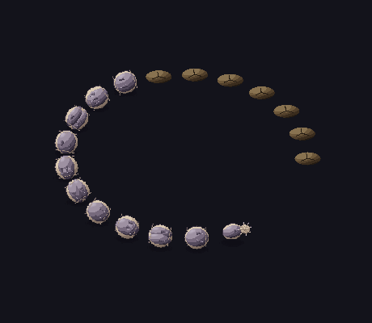

> Собрано из тех же частей (`head` + `body/*` + `tail`), что и тайлы ниже. Голова
> ориентируется по направлению движения (её пасть/глаз поворачиваются вместе с
> ней — те же 360°, что и в 8 направлениях). Под землёй части скрыты — видны только
> бугор (`fx/head_burrowed_mound`) и пыль; на поверхности — полные спрайты с тенью.
> В движке ту же сборку даёт цепочка из `world_eater.json` (24 сегмента, шаг 26 px,
> follow-the-leader) — спрайт каждого сегмента берётся по углу к предыдущему.

## Голова — покой и главный ужас

| head_idle | head_hurt |
|:---:|:---:|
|  | 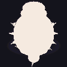 |
| «дыхание», лёгкий боб, пульс глаза и глотки | красная вспышка при уроне |

## Пробой из земли (Breach Slam)

| ground_crack_warning | head_breach | shadow (rise) | head_submerge |
|:---:|:---:|:---:|:---:|
|  | 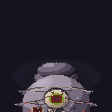 | 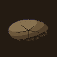 | 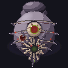 |
| **телеграф на полу**: трещина в точке выхода (0.9 с) | голова вылетает вверх, пасть раскрыта | холм — след движения под землёй | уход обратно вниз |

## Укус (ближняя атака)

| head_bite_windup | head_bite_strike | head_bite_recover |
|:---:|:---:|:---:|
| 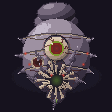 | 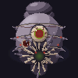 | 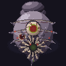 |
| **телеграф**: пасть раскрывается крестом, глаз вспыхивает | выпад вперёд, клыки смыкаются | оседает — **окно урона по голове** |

## Кислота — залп и лужи

| head_spit_windup | head_spit_radial | acid_projectile | head_spit_pool |
|:---:|:---:|:---:|:---:|
| 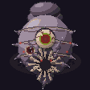 | 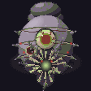 |  | 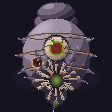 |
| глотка раздувается и светится | круговой залп (8→12 снарядов, есть зазор) | летящий сгусток кислоты | наклон вниз, тягучий плевок луж |

| acid_impact | pool_spawn | pool_loop | pool_fade |
|:---:|:---:|:---:|:---:|
|  |  |  |  |
| брызги при попадании | лужа растекается | кипит, замедляет 30% (6 урона/с) | лужа истаивает |

## Хвост (Tail Sweep — дуга 180°)

| tail_idle | tail_sweep_windup | tail_sweep_strike | tail_submerge |
|:---:|:---:|:---:|:---:|
| 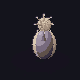 |  | 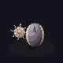 | 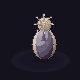 |
| костяное жало-булава покачивается | замах: жало заносится | хлыст дугой 180°, отброс | уход под землю |

## Тело — сегменты и погружение

| surface_loop (A) | surface_loop (B) | surface_loop (C) |
|:---:|:---:|:---:|
| 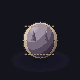 | 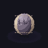 | 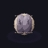 |
| вариант A (2 шипа) | вариант B (гребень, 3 шипа) | вариант C (две дольки) |

Частичное погружение (для кадров выхода/ухода) — сегмент в грунте с кольцом
взрытой земли:

| partial 25% | partial 50% | partial 75% |
|:---:|:---:|:---:|
| 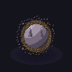 | 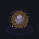 | 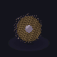 |
| 25% под землёй | 50% под землёй | 75% под землёй |

## Фаза 2, рёв и смерть · пыль

| head_roar | head_death | dust_trail | dirt_burst_ring |
|:---:|:---:|:---:|:---:|
| 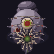 | 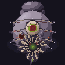 |  | 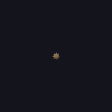 |
| перелом в ф.2 — броня трескается | пасть опадает, голова оседает | пыль над подземным ходом | кольцевой выброс грунта при выходе |

## Направления (8 честных ракурсов) {#направления-8-честных-ракурсов-worm}

Свет у Червя **экранный** (сверху-спереди-слева, одинаков всюду), поэтому спрайты
**нельзя отражать** — все 8 направлений нарисованы честно (`mirrored: []` в json).
Голова в покое через все ракурсы (`down → down_left → left → up_left → up → …`):

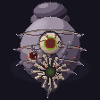

---

# 🕷️ Ткачиха (weaver)

Гигантская паучиха-матка. Референс — The Weaver из Path of Exile 1. Раздутое
брюшко с копошащимся выводком, кластер горящих глаз, хелицеры с капающим ядом, а
в хитин спины вплавлены **вросшие человеческие остатки** — кричащее лицо и
тянущаяся рука (читается со второго взгляда). Тело `128×128`.

> 4500 HP · слабая точка — брюшко (урон ×2, копит стаггер) · 3 фазы: наземный
> бой → кокон с выводком → треснувшее брюшко + яд. Детали — в `../mechanics/`.

## Передвижение

| idle | walk_loop | dash_web |
|:---:|:---:|:---:|
| 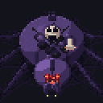 |  | 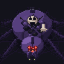 |
| покой — «дыхание», лёгкий переступ, пульс выводка | тетраподная походка, восемь лап переступают | рывок через арену, семенит, оставляет полосу паутины |

## Укус (ближняя атака)

| bite_windup | bite_strike | bite_recover |
|:---:|:---:|:---:|
|  | 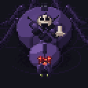 | 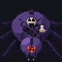 |
| **телеграф**: встаёт на дыбы, передние лапы вскинуты | выпад вниз-вперёд, клыки бьют | оседает — **брюшко открыто (уязвим)** |

## Прыжок

| leap_windup | leap_air | leap_land |
|:---:|:---:|:---:|
|  | 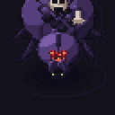 | 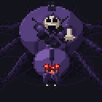 |
| глубокий присед, лапы сжаты | в воздухе — лапы поджаты, тело высоко | удар о землю, лапы растопырены |

## Дальний бой — паутина

| web_shot_windup | web_shot_fire | web_projectile | web_patch (loop) |
|:---:|:---:|:---:|:---:|
|  | 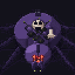 | 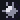 | 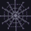 |
| разворот брюшком к цели, свечение растёт | выброс, отдача брюшка | летящий комок нитей | пятно на полу (замедляет, тайлится) |

| web_patch_spawn | web_patch_break |
|:---:|:---:|
|  | 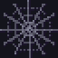 |
| паутина расстилается | рвётся клочьями (2 удара) |

## Яд (фаза 3)

| venom_spray | venom_pool |
|:---:|:---:|
|  | 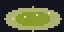 |
| конус яда перед собой, клыки светятся | ядовитая лужа |

## Призыв выводка

| summon_screech | lay_eggsac |
|:---:|:---:|
|  | 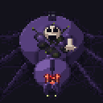 |
| встаёт на дыбы, брюшко вспыхивает светом выводка | приседает и выталкивает кокон |

### Коконы выводка (eggsac)

| eggsac_idle | eggsac_pulse | eggsac_hatch | eggsac_destroyed |
|:---:|:---:|:---:|:---:|
| 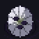 | 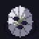 | 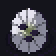 | 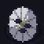 |
| шёлковый мешок, свечение внутри | пульсирует перед вылуплением | трескается, выпускает паучков | уничтожен — шёлк опадает |

### Паучок (spiderling) — `40×40`

| idle | walk | jump | attack | death |
|:---:|:---:|:---:|:---:|:---:|
| 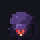 |  |  | 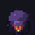 | 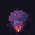 |
| 4 горящих глаза, колючие лапки | семенит | прыжок | укус с каплей яда | подгибает лапки |

## Фаза 2 — кокон (неуязвимость, бой передаётся выводку)

| cocoon_wrap | cocoon_idle | cocoon_break |
|:---:|:---:|:---:|
|  | 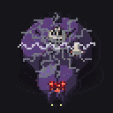 | 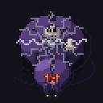 |
| заматывается в шёлк в центре арены | неуязвима, стреляет нитями | вскрывается (2 кокона + 6 паучков / 25 с) |

## Переход в фазу 3 и её циклы

| phase_transition | idle_p3 | walk_loop_p3 |
|:---:|:---:|:---:|
| 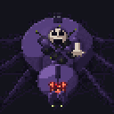 | 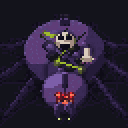 | 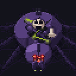 |
| трескается брюшко, изнутри бьёт яд | покой — брюшко открыто постоянно | ходьба с треснувшим брюшком |

## Урон и смерть

| hurt | death |
|:---:|:---:|
| 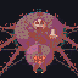 | 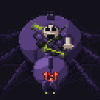 |
| красная вспышка | лапы подгибаются внутрь, брюшко оседает и приплющивается |

## Прочие эффекты

| silk_burst | leap_shadow_warning | shadow_leap |
|:---:|:---:|:---:|
|  |  |  |
| всплеск шёлка (рывок/вскрытие) | тень-телеграф места приземления | тень тела в прыжке (сжимается) |

## Направления (8 честных ракурсов)

Свет у Ткачихи **экранный** (сверху-спереди-слева, одинаков всюду), поэтому
отражать спрайты нельзя — все 8 направлений нарисованы честно. Ходьба по кругу
через все ракурсы (`down → down_left → left → up_left → up → …`):

---

## Заметки

- Ноги — **гибрид**: запечены в каждый кадр процедурной походкой (лист
  самодостаточен), плюс модульные сегменты + точки крепления в `weaver.json` для
  рантайм-IK, если движок захочет ставить их сам.
- Слабая точка (брюшко) видна сверху всегда; `weakpoint_box` и кадры открытости —
  в `weaver.json`.
- Пока в игровой код бой не подключён — арт-пайплайн апстрим (`weaver.json` не
  потребляется движком). Механики — следующий шаг (Блок B).
- Палитра наследуется от `world_eater`; новых оттенков 4 (яд + рампа шёлка) —
  `palette_additions.hex`.
