# Гемы — витрина иконок

Статус: 🟢 иконки готовы (6 скилл-гемов + 18 камней поддержки)
Связь: `../mechanics/skills.md` (скиллы и поддержки), `../mechanics/tags.md` (теги),
`../mechanics/items.md` (сокеты), `art-direction.md` (как рисуем)

Гемы вставляются в **сокеты** на амуниции (`../mechanics/skills.md`): в сокет —
**скилл** ИЛИ **камень поддержки**. Иконки нужны для сокетов, панели умений и
инвентаря. Нативно 32×32, апскейл ×8, огранённый камень на прозрачном фоне с
тёмным контуром; в витрине — 128px.

**Кодировка (цвет + форма):**
- **Форма:** ● round — **скилл-гем**, ◆ rhombus — **камень поддержки**.
- **Цвет:** категория/тип урона — красный (атака/физ.), зелёный (дальний/снаряд/
  перемещение), синий (чары/призыв/аура/длительность), + цвета стихий/хаоса.
- **Глиф внутри** — подсказка конкретного тега/скилла.

> Картинки — чистым Markdown (``). Исходники: `assets/sprites/gems/{skill,support}/`.
> Перегенерация: `go run ./tools/gemgen assets/sprites/gems` → `bash tools/gifgen.sh`.

---

## Скилл-гемы (round) — 6 умений

| Гем | Скилл | Теги |
|:--:|-------|------|
| 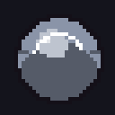 | **Раскол** (raskol) | Ближний бой · Область |
|  | **Вихрь** (vortex) | Ближний бой · Область · Длительность |
| 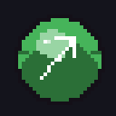 | **Пронзающая стрела** (pierce) | Дальний бой · Снаряд |
|  | **Теневой рывок** (dash) | Ближний бой · Перемещение |
| 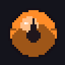 | **Огненный шар** (fireball) | Чары · Снаряд · Область · Огонь |
|  | **Турель** (turret) | Призыв · Длительность · Дальний бой |

---

## Камни поддержки (rhombus) — по одному на тег

### Способ доставки
| Гем | Тег | Эффект (плейсхолдер) |
|:--:|-----|----------------------|
|  | **Атака** | +20% урона атак |
|  | **Ближний бой** | +20% урона ближнего боя |
| 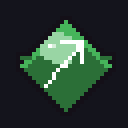 | **Дальний бой** | +20% урона дальнего боя |
|  | **Чары** | +20% урона чар |

### Механика
| Гем | Тег | Эффект (плейсхолдер) |
|:--:|-----|----------------------|
|  | **Область** | +20% размера области |
| 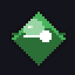 | **Снаряд** | +20% урона снарядов |
| 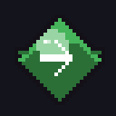 | **Перемещение** | +20% дальности перемещения |
|  | **Призыв** | +20% прочности призванного |
|  | **Миньоны** | +20% урона миньонов |
| 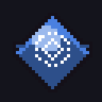 | **Аура** | +20% эффекта ауры |
|  | **Проклятие** | +20% эффекта проклятия |
|  | **Длительность** | +20% длительности |

### Тип урона
| Гем | Тег | Эффект (плейсхолдер) |
|:--:|-----|----------------------|
|  | **Физический** | +20% физ. урона |
| 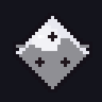 | **Стихия** | +20% урона стихиями |
| 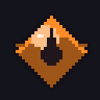 | **Огонь** | добавляет урон огнём (даёт тег Огонь) |
| 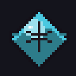 | **Холод** | добавляет урон холодом (даёт тег Холод) |
| 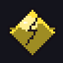 | **Молния** | добавляет урон молнией (даёт тег Молния) |
|  | **Хаос** | добавляет урон хаосом (даёт тег Хаос) |

---

## Заметки

- Нарисованы параметрически (`tools/gemgen`, stdlib, вне игры) — как остальные
  спрайты. Огранка: заливка цветом + светлый «стол» сверху, тёмные нижние грани,
  блик; глиф — контрастным к камню цветом.
- Эффекты поддержек — **плейсхолдеры** из `../mechanics/skills.md` (крутятся на балансе).
- Подключение в UI (сокеты/инвентарь) — вместе с экраном инвентаря (см. `screens.md`,
  экран «Инвентарь, экипировка и сокеты»).
