# Герои — визуальная витрина

Статус: 🟢 спрайты готовы (6 героев × 3 вида × 6 анимаций)
Связь: `../mechanics/characters.md` (роли/лор/умения), `art-direction.md` (как рисуем),
`to-draw.md` (бэклог), код — `internal/hero`, `internal/anim`

Наглядный каталог **всех героев в движении**: каждая анимация — живой GIF на
тёмном игровом фоне, скорость = как в игре. Здесь «как выглядит»; роли, защита и
билды — в `../mechanics/characters.md`.

**Направления (top-down).** Три реальных вида: **front** (`down`), **back**
(`up`) и **side** (профиль лицом вправо). Взгляд **влево** — это side,
**отражённый** по горизонтали (в игре при движении влево). Итого 4 направления
взгляда из 3 наборов кадров: front / back / вправо / влево.

> Картинки — чистым Markdown (``), анимация видна в любом просмотрщике.
> Кадры-исходники: `assets/sprites/heroes/<id>/<down|up|side>/<action>/` (16 PNG).
> Перегенерация: `go run ./tools/spritegen assets/sprites/heroes` → `bash tools/gifgen.sh`.

## Анимации (что показываем)

| Действие | Что это |
|----------|---------|
| **idle** | покой — лёгкое «дыхание» |
| **walk** | ходьба — попеременный шаг |
| **attack** | удар оружием (замах стартового умения) |
| **punch** | базовый удар (без оружия) |
| **take_damage** | получение урона — красная вспышка + отдача |
| **loot** | подбор предмета — наклон к земле |

Каждая анимация — **16 кадров**, нативно 32×32, апскейл ×8 (в игре 256×256; в
витрине 128px). `down` — исходный `base.png`; `up` (спина) и `side` (профиль)
строятся в `tools/spritegen` (спина — заливкой лица, профиль — параметрической
пиксель-отрисовкой в палитре героя). Подробности — `art-direction.md`.

---

## 💪 Сила → Броня

### ⚔️ Рыцарь (knight) — стойкость
**Сила · Броня · ближний физ.** · Старт-умение: **Раскол** · Ресурс: Мана
«Я — стена и меч. Держу строй, принимаю удар, бью в ответ.»

| вид | idle | walk | attack | punch | take_damage | loot |
|:--:|:--:|:--:|:--:|:--:|:--:|:--:|
| front | 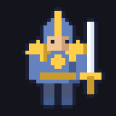 | 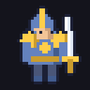 |  |  | 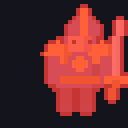 |  |
| back | 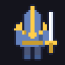 | 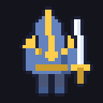 |  |  | 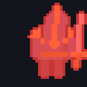 |  |
| side | 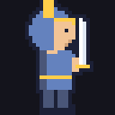 | 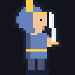 |  |  | 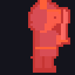 |  |

### 🪓 Дикарь (barbarian) — ярость
**Сила · Броня · ближний физ. + вампиризм** · Старт-умение: **Вихрь** · Ресурс: Здоровье
«Ярость во плоти. Чем жарче бой, тем я сильнее.»

| вид | idle | walk | attack | punch | take_damage | loot |
|:--:|:--:|:--:|:--:|:--:|:--:|:--:|
| front | 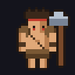 | 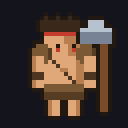 |  |  | 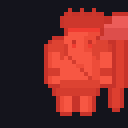 |  |
| back | 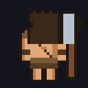 | 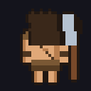 |  |  | 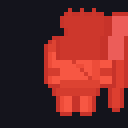 |  |
| side | 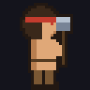 | 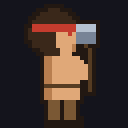 |  |  | 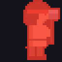 |  |

---

## 🏹 Ловкость → Уклонение

### 🎯 Следопыт (ranger) — кайт
**Ловкость · Уклонение · дальний физ. + крит** · Старт-умение: **Пронзающая стрела** · Ресурс: Мана
«Точность и дистанция. Бью раньше, чем они дойдут.»

| вид | idle | walk | attack | punch | take_damage | loot |
|:--:|:--:|:--:|:--:|:--:|:--:|:--:|
| front | 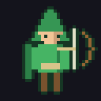 | 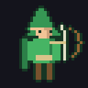 |  |  | 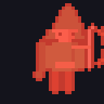 |  |
| back | 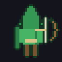 | 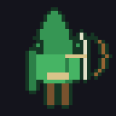 |  |  | 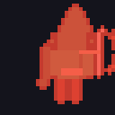 |  |
| side | 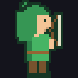 | 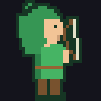 |  |  | 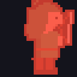 |  |

### 🗡️ Ассасин (assassin) — бурст
**Ловкость · Уклонение · ближний физ. + крит** · Старт-умение: **Теневой рывок** · Ресурс: Мана
«Тень и клинок. Врываюсь, взрываю цель, исчезаю.»

| вид | idle | walk | attack | punch | take_damage | loot |
|:--:|:--:|:--:|:--:|:--:|:--:|:--:|
| front | 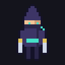 | 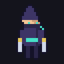 |  |  | 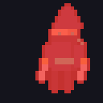 |  |
| back | 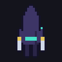 | 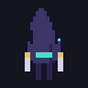 |  |  | 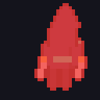 |  |
| side | 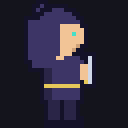 | 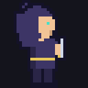 |  |  | 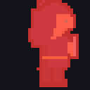 |  |

---

## 🔮 Интеллект → Энергощит

### 🔥 Маг (mage) — стихии
**Интеллект · Энергощит · дальние чары** · Старт-умение: **Огненный шар** · Ресурс: Мана
«Буря стихий. Выжигаю толпы издалека.»

| вид | idle | walk | attack | punch | take_damage | loot |
|:--:|:--:|:--:|:--:|:--:|:--:|:--:|
| front | 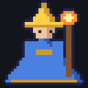 | 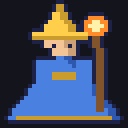 |  |  | 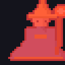 |  |
| back |  | 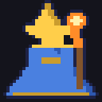 |  |  | 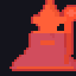 |  |
| side | 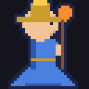 | 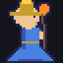 |  |  | 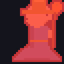 |  |

### ⚙️ Инженер (engineer) — зона/турели
**Интеллект · Энергощит · дальний/непрямой** · Старт-умение: **Турель** · Ресурс: Мана
«Бьют не руки, а мои машины. Держу зону техникой.»

| вид | idle | walk | attack | punch | take_damage | loot |
|:--:|:--:|:--:|:--:|:--:|:--:|:--:|
| front | 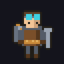 | 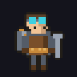 |  |  | 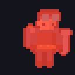 |  |
| back | 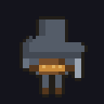 | 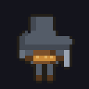 |  |  | 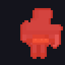 |  |
| side |  |  |  |  |  |  |

---

## Заметки

- Все **6 действий × 3 вида** подключены в коде (`hero.Clip(action, facing)`),
  раскладка `assets/sprites/heroes/<id>/<down|up|side>/<action>/`.
- В галерее (`CHOOSE HEROES` → showcase) стрелки **вверх/вниз** переключают вид
  (front / back / side → / side ←), **влево/вправо** — героя.
- **side** — настоящий профиль (лицом вправо), нарисован параметрически из
  палитры героя (`spritegen.buildSide`); взгляд влево = тот же профиль, зеркально.
- Эффекты умений (Раскол, Огненный шар и т.д.) — отдельная витрина: `skills.md`.
