# Предметы — визуальная витрина

Статус: 🟡 базовые иконки готовы (18 баз); редкости/аффиксы — post-MVP
Связь: `../mechanics/items.md` (система лута), `art-direction.md` (как рисуем),
`to-draw.md` (бэклог)

Каталог **иконок базовых предметов** для панели экипировки. Иконки **статичные**
(без анимации), поэтому здесь обычные PNG, а не GIF. Что за предметы, сокеты,
редкости и дроп — в `../mechanics/items.md`.

**Материал кодирует тип защиты** (`../mechanics/damage-and-defense.md`):
**сталь → Броня** (Сила) · **кожа → Уклонение** (Ловкость) · **ткань+руна →
Энергощит** (Интеллект). Так по виду сразу ясен защитный профиль базы.

> Исходники: `assets/sprites/items/…` (256×256). В витрине — ресайз до 128px в
> `media/items/` (magick). Иконки рисует процедурный Go-генератор (как герои и
> скиллы), живущий вне игрового кода.

---

## 🛡️ Броня (4 слота × 3 типа защиты)

| Слот | Сталь — Броня | Кожа — Уклонение | Ткань — Энергощит |
|------|:-------------:|:----------------:|:-----------------:|
| **Нагрудник** | 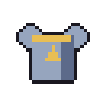 | 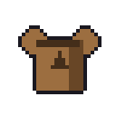 | 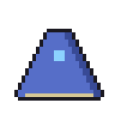 |
| **Шлем** | 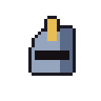 | 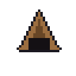 |  |
| **Перчатки** | 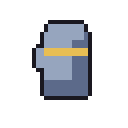 | 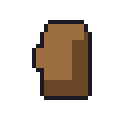 | 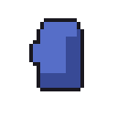 |
| **Сапоги** | 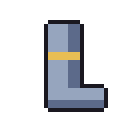 | 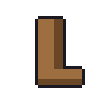 |  |

Нагрудник — 4 сокета, остальное по 2 (число на дропе случайно, см. `../mechanics/items.md`).

## ⚔️ Оружие (по одному на класс)

| Меч · Рыцарь | Топор · Дикарь | Лук · Следопыт | Кинжалы · Ассасин | Посох · Маг | Ключ · Инженер |
|:---:|:---:|:---:|:---:|:---:|:---:|
| 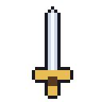 | 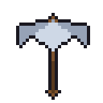 | 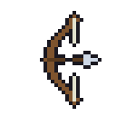 | 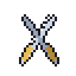 | 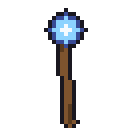 | 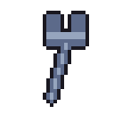 |

Оружие даёт базовый урон атак и скорость (числа — `../progression/character-progression.md`).

---

## Впереди (ещё не нарисованы)

- **Иконки скиллов и гемов** (для сокетов/панели) — `to-draw.md`.
- **Редкости/аффиксы** (Магический/Редкий/Уникальный) и их подсветка — post-MVP.
