# «Плетёная Могила» — тайлсет и превью

Процедурно нарисованные элементы арены Ткачихи (`tools/envgen`), вид сверху ~65°,
единый свет сверху-слева — как у боссов. Собрано по слоям (`../../../tech/rendering.md`).

Перегенерация: `go run ./tools/envgen`. В игру (когда одобрим):
`go run ./tools/envgen assets/sprites/env/weaver_grave`.

## Собранное превью (все слои)

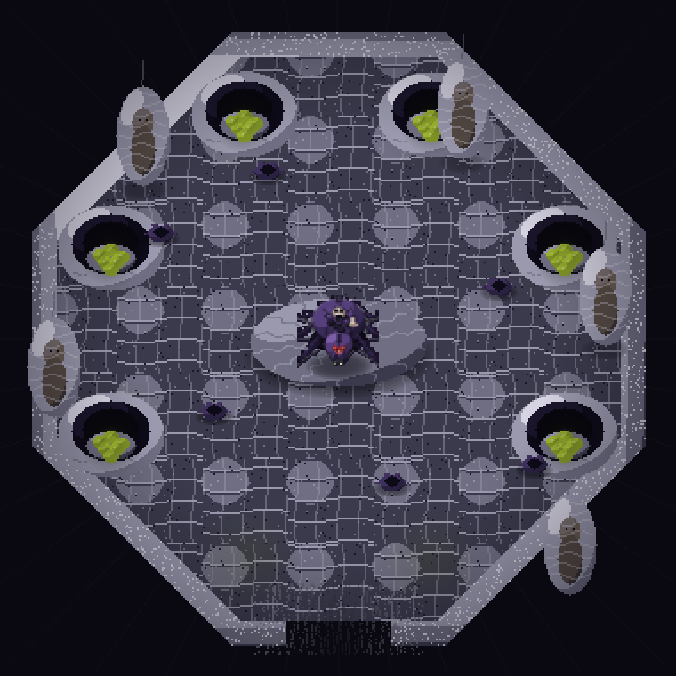

Слои: фон → пол → напольный свет → стена → помост → альковы+кладки → husks →
Ткачиха (для масштаба) → мембрана входа → свисающие коконы → виньетка.

## Плитки и пропы

| Элемент | Слой | Что это |
|---|---|---|
| 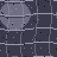 | пол | пол — шёлковое плетение (вариант A) |
| 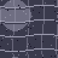 | пол | пол — вариант B |
| 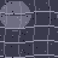 | пол | пол — вариант C |
| 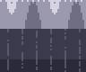 | стена | стена-паутина (верхняя грань + высота), тайлится по горизонтали |
| 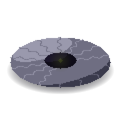 | объект | центральный помост (кокон ф.2), тёмная лунка + ядовитое свечение |
| 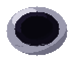 | объект | периметральный альков (ниша под кокон выводка) |
| 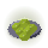 | объект/свет | кладка светящихся яиц (источник зелёного света) |
| 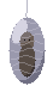 | надземное | свисающий кокон-жертва (надземный слой), силуэт человека |
| 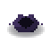 | объект | высохший панцирь добычи (пропа на полу) |
| 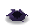 | объект | husk — вариант B |
| 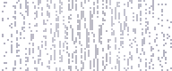 | вход | шёлковая мембрана входа (арена-лок) |
