# Мобы — визуальная витрина

Статус: 🟡 мясо готово (3 типа × 3 вида × 3 анимации); Големы/Элита — впереди
Связь: `../mechanics/enemies.md` (роли/поведение/ИИ), `art-direction.md` (как рисуем),
`to-draw.md` (бэклог)

Наглядный каталог **мобов в движении**: каждая анимация — живой GIF на тёмном
игровом фоне, скорость проигрывания ≈ как в игре. Здесь — «как выглядит»; роли,
урон, ИИ и матрица «кто чей кошмар» — в `../mechanics/enemies.md`.

**Направления (3/4 top-down, как в Necesse).** У мобов три реальных вида —
**`down`** (к камере), **`up`** (спина/от нас), **`side`** (профиль). Вид влево —
это `side`, **отражённый** по горизонтали в движке. Итого 4 стороны из 3 наборов
кадров. Звери имеют настоящий профиль (в отличие от героев — там бок = флип фронта).

**Анимации:** `idle` (покой/дыхание) · `walk` (движение: бег/переваливание/полёт) ·
`attack` (выпад с укусом/пастью). Каждая — **8 кадров**, нативно 32×32, ×8.

> Картинки — чистым Markdown (``), анимация видна в любом просмотрщике.
> Кадры-исходники: `assets/sprites/mobs/<id>/<dir>/<action>/` (8 PNG).
> Перегенерация GIF: `bash tools/gifgen.sh` (после правки кадров).

---

## 🩸 Мясо (обычные, часто)

### Кусака — свирепый четвероногий зверь
Красные глаза, кровавая пасть, шипы на хребте, хвост. Быстрый рой, кусает в упор.

| Вид | idle | walk | attack |
|-----|------|------|--------|
| **down** | 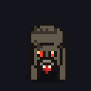 | 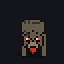 |  |
| **up** | 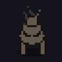 | 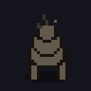 |  |
| **side** | 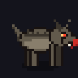 | 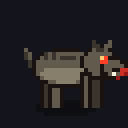 |  |

### Пузырь — раздутая гнилая тварь
Мокрый блеск, пятна гнили, волдыри, культяпки-ножки, злые запавшие глаза.
Медленный, чуть живучее.

| Вид | idle | walk | attack |
|-----|------|------|--------|
| **down** | 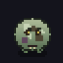 | 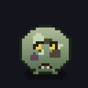 |  |
| **up** | 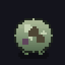 | 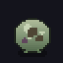 |  |
| **side** | 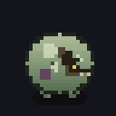 |  |  |

### Мошка — крылатый мутировавший рой
Хитин, красные глазки, полупрозрачные машущие крылья, жвалы. Парит, летит прямо.

| Вид | idle | walk | attack |
|-----|------|------|--------|
| **down** | 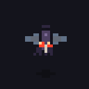 |  |  |
| **up** | 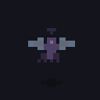 |  |  |
| **side** | 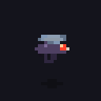 |  |  |

---

## Впереди (ещё не нарисованы)

- **🗿 Големы-стихии** — 1 база + 4 расцветки (огонь/холод/молния/хаос), направленные.
- **👑 Элита** — Латник, Чернокнижник (2+ атаки), направленные.

См. бэклог `to-draw.md` и набор `../mechanics/enemies.md`.
