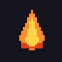
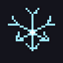
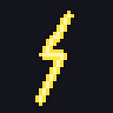
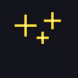
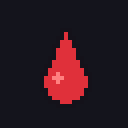
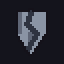
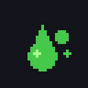
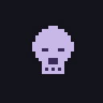
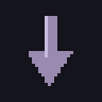
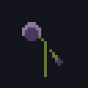

# Иконки статусов — витрина

Статус: 🟢 иконки готовы (10 статусов)
Связь: `../mechanics/damage-and-defense.md` (что делает каждый статус),
`art-direction.md` (как рисуем), код — HUD (`internal/ui`), пока не подключены

Иконки эффектов для **HUD**: показываются на игроке/цели, когда висит статус.
Нативно 32×32, апскейл ×8 (256×256), символ на прозрачном фоне с тёмным контуром,
**цвет по типу урона**. В витрине — 128px на тёмном фоне (как в бою).

> Картинки — чистым Markdown (``). Исходники: `assets/sprites/status/<name>.png`.
> Перегенерация: `go run ./tools/statusgen assets/sprites/status` → `bash tools/gifgen.sh`.

Статусы и их эффекты — из `../mechanics/damage-and-defense.md`. В базе статусы
**не стакаются** (держится сильнейший); стаки открываются в дереве прокачки.

---

## 🔥❄️⚡ Стихии (контра — Сопротивления)

| Иконка | Статус | Что делает |
|:--:|--------|------------|
|  | **Поджог** (ignite) · Огонь | урон огнём во времени (DoT), % от нанесённого удара |
|  | **Заморозка** (freeze) · Холод | охлаждение замедляет; при сильном ударе — полностью обездвиживает |
|  | **Шок** (shock) · Молния | цель получает **больше урона** от всех источников |

## ⚔️ Физический (контра — Броня/Блок)

| Иконка | Статус | Что делает |
|:--:|--------|------------|
|  | **Оглушение** (stun) | короткое прерывание/обездвиживание при тяжёлом ударе |
|  | **Кровотечение** (bleed) | физ. урон во времени; сильнее, если цель движется |
|  | **Раздробление** (sunder) | снижает броню цели → она получает больше физ. урона |

## ☠️ Хаос / Яд (обходит энергощит)

| Иконка | Статус | Что делает |
|:--:|--------|------------|
|  | **Яд** (poison) | урон-DoT (хаос+физ); в базе один сильнейший, стаки — в дереве |
|  | **Проклятие** (curse) | уязвимость: −сопротивления / +получаемый урон |
|  | **Обессиливание** (weaken) | цель наносит меньше урона |
|  | **Иссушение** (wither) | +получаемый урон хаосом и режет реген цели |

---

## Заметки

- Цвет кодирует тип урона: огонь — оранжевый, холод — голубой, молния — жёлтый,
  физ. — сталь/красный, хаос — зелёный/фиолетовый.
- Иконки нарисованы параметрически (`tools/statusgen`, stdlib, вне игры) — как
  спрайты героев/скиллов.
- **Подключение в HUD** — когда появятся статусы в бою (пока сами статусы —
  post-MVP, см. `../mechanics/damage-and-defense.md`). Иконки готовы заранее.
