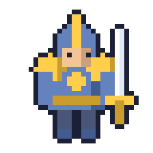
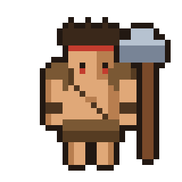
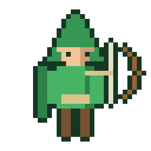
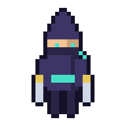
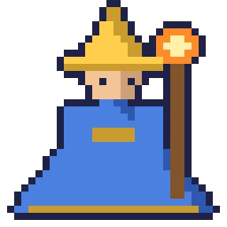
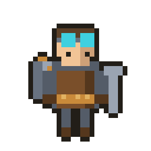

# Персонажи (архетипы)

Статус: 🟡 черновик — 6 стартовых героев (по 2 на атрибут)
Связь с кодом: `internal/hero` (реестр героев и наборы анимаций), `internal/anim` (клипы)

Спрайты каждого героя лежат в `assets/sprites/heroes/<id>/`: статичный `base.png`
(256×256, нативная сетка 32×32 ×8) плюс наборы анимаций по **16 кадров** —
`idle/`, `walk/`, `attack/`, `punch/`, `take_damage/`, `loot/` (`frame_00.png … frame_15.png`).
Идентификаторы (`<id>`) совпадают с именами каталогов и с константами `hero.ID`
в коде. Кадры генерируются процедурно из `base.png` (см. `../design/art-direction.md`).

Шесть стартовых героев по классической ARPG-триаде **Сила / Ловкость / Интеллект**.
Каждый **атрибут** завязан на свою **механику защиты** — так тройки ощущаются
по-разному в бою (пиллар «каждый бой проверяет билд»). Внутри атрибута — два
героя с одной защитой, но **разным темпераментом** (контроль vs агрессия и т.п.).

> **Важно:** архетип — это *стартовая точка*, а не клетка. Билд-крафт — ось игры
> (см. `../vision.md`): Рыцарь может уйти в крит, Инженер — в ближний бой.
> Классы задают уклон, а не судьбу.

## Сводка

| Атрибут | Защита | Герой | Роль | Урон | Дистанция |
|---------|--------|-------|------|------|-----------|
| **Сила** | Броня | Рыцарь | стойкость | физ. | ближний |
| **Сила** | Броня | Дикарь | ярость | физ. + вампиризм | ближний |
| **Ловкость** | Уклонение | Следопыт | кайт | физ. + крит | дальний |
| **Ловкость** | Уклонение | Ассасин | бурст | физ. + крит | ближний |
| **Интеллект** | Энергощит | Маг | стихии | огонь/холод/молния | дальний |
| **Интеллект** | Энергощит | Инженер | зона/турели | техно (непрямой) | дальний |

## Ресурсы (текущая модель)

Пока в игре **два ресурса: Здоровье и Мана**, у каждого свой **реген**. Скиллы
стоят ману (у Дикаря — здоровье). Уникальные ресурсы (Доблесть/Ярость/Фокус/
Энергия/Заряд) **отложены на потом** как тема/флейвор — ниже помечены «тема на будущее».

---

## 💪 Сила → Броня

**Защита — Броня:** снижает физ. урон, тем сильнее чем слабее удар. Стабильно
перемалывает мелочь, продавливается тяжёлыми ударами. Оба героя — ближний
физический бой, но противоположны по духу.

### ⚔️ Рыцарь — стойкость

- **Фантазия:** «Я — стена и меч. Держу строй, принимаю удар, бью в ответ».
- **Стиль:** ближний, устойчивый, тяжёлая броня/щит.
- **Ресурс — Мана:** тратится на активные приёмы. *(Тема на будущее: «Доблесть».)*
- **Изюминка:** устойчивость (сложнее отбросить/оглушить), блок.
- **Стартовое умение — «Раскол»:** размашистый удар по дуге, задевает нескольких.

### 🪓 Дикарь — ярость

- **Фантазия:** «Ярость во плоти. Чем жарче бой, тем я сильнее».
- **Стиль:** ближний, безрассудный, двуручный — мало брони, много урона.
- **Ресурс — Здоровье:** скиллы стоят жизнь — вписывается в вампиризм и «чем жарче бой». *(Тема на будущее: «Ярость».)*
- **Изюминка:** вампиризм (лечится от урона), злее на низкой жизни.
- **Стартовое умение — «Вихрь»:** круговой удар по всем вокруг.

## 🏹 Ловкость → Уклонение

**Защита — Уклонение:** шанс полностью избежать удара. В среднем спасает, но
«на удачу» — можно словить серию. Оба ставят на скорость и крит, но с разной
дистанции.

### 🎯 Следопыт — кайт

- **Фантазия:** «Точность и дистанция. Бью раньше, чем они дойдут».
- **Стиль:** дальний, подвижный, лук.
- **Ресурс — Мана:** тратится на особые выстрелы. *(Тема на будущее: «Фокус».)*
- **Изюминка:** пробивание рядов, замедляющие/трюковые стрелы.
- **Стартовое умение — «Пронзающая стрела»:** прошивает насквозь ряд врагов.

### 🗡️ Ассасин — бурст

- **Фантазия:** «Тень и клинок. Врываюсь, взрываю цель, исчезаю».
- **Стиль:** ближний, кинжалы, рывки и скрытность.
- **Ресурс — Мана:** тратится на рывки и усиленные удары. *(Тема на будущее: «Энергия теней».)*
- **Изюминка:** рывок сквозь врага, мощный удар из скрытности.
- **Стартовое умение — «Теневой рывок»:** рывок с ударом по цели.

## 🔮 Интеллект → Энергощит

**Защита — Энергощит:** буфер поверх жизни, сам восстанавливается после паузы
без урона. Мощно против одиночных угроз, ломается под быстрым натиском (и
обходится уроном Хаоса). Оба дальнобойные «умники», но по-разному наносят урон.

### 🔥 Маг — стихии

- **Фантазия:** «Буря стихий. Выжигаю толпы издалека».
- **Стиль:** дальний, заклинания, урон по области.
- **Ресурс — Мана:** тратится на заклинания; управление маной — часть скилла.
- **Изюминка:** комбо стихий и статусов (поджог/заморозка/шок).
- **Стартовое умение — «Огненный шар»:** снаряд с уроном по области при попадании.

### ⚙️ Инженер — зона/турели

- **Фантазия:** «Бьют не руки, а мои машины. Держу зону техникой».
- **Стиль:** дальний/непрямой, развёртывания (турели, мины, дроны).
- **Ресурс — Мана:** тратится на постройку/активацию устройств. *(Тема на будущее: «Заряд».)*
- **Изюминка:** ставит автономные пушки/ловушки, сам держится позади.
- **Стартовое умение — «Турель»:** разворачивает автоматическую пушку.

---

## Почему такая шестёрка

- Покрывает триаду **Сила/Ловкость/Интеллект** — каркас всей прогрессии.
- Ложится на три **механики защиты** (`damage-and-defense.md`): броня / уклонение /
  энергощит — у каждой свой характер.
- Внутри атрибута — **контраст ролей**: контроль/дистанция vs агрессия/сближение,
  чтобы даже одна защита давала два разных геймплея.
- Специфичны и узнаваемы, но НЕ всеобъемлющи — оставляют место для гибридов.

## Куда расти (будущие герои)

Дальше логично ветвиться **гибридами между атрибутами** и новыми темами:
- **Заклинатель клинка** (Сила×Интеллект) — ближний бой + стихии.
- **Призыватель** (Интеллект) — армия миньонов.
- **Отравитель/Хаос** — урон хаосом и эффекты во времени (контрит энергощит).
- **Паладин** (Сила×Интеллект) — аура, лечение, щиты (задел под ко-оп).

## Открытые вопросы

- Уклонение — чистый шанс или с гарантиями от «слить на невезении»?
- Стартовые умения жёстко за героем или сразу выбираемы из пула?
- Внешность: пол/варианты, кастомизация цвета.
